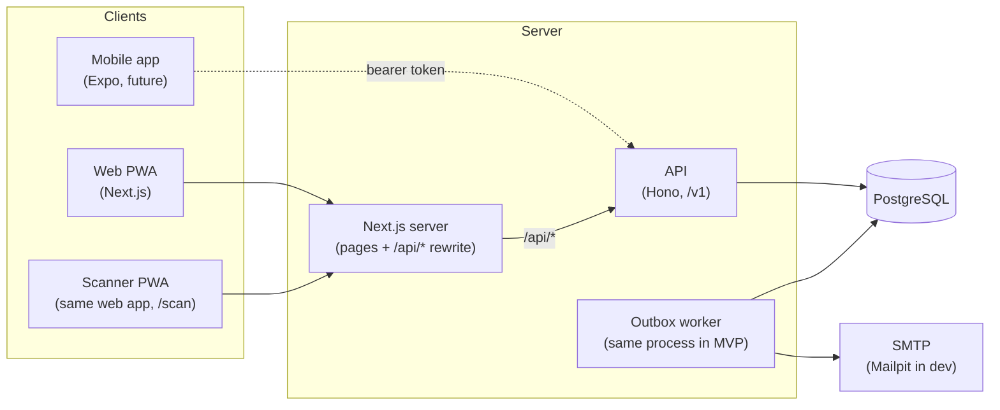

# Architecture

> Status: **Proposed** (Phase 0). Nothing here is implemented yet. Companion documents:
> [`DATA_MODEL.md`](DATA_MODEL.md), [`ROADMAP.md`](ROADMAP.md) and the ADRs in [`adr/`](adr/).

## 1. Goals and constraints

- One business-logic layer (`apps/api`) consumed by the web PWA today and an Expo app later.
- Shared, platform-agnostic domain code (`packages/core`): no Node APIs, no DOM.
- Self-hostable with a single `docker compose up`; no paid or proprietary services.
- Security first: signed QR tokens, server-side verification, idempotent check-in,
  resource-level authorization, OWASP ASVS level 1.
- Offline-capable scanner (Phase 4b).
- Multi-tenant ready (organizations) without building billing.

## 2. System overview



- **Single origin.** In every environment the browser sees one origin: `/` is Next.js and
  `/api/*` is rewritten by Next.js to the API container (or routed by a reverse proxy in
  production). Session cookies stay first-party, CORS is not needed for
  the web app, and CSRF is reduced to an `Origin` check plus `SameSite=Lax` cookies.
  See [ADR-0004](adr/0004-single-origin-deployment-and-sessions.md).
- **Next.js has no business logic.** It renders UI and calls the API through the generated
  typed client. Server components may call the API server-side, forwarding the session cookie.
- **The API owns everything else:** auth (Better Auth mounted at `/v1/auth/*`), validation,
  authorization, token signing, check-in, email outbox, audit.
- **Mobile (future)** talks to the API directly with a bearer session (Better Auth Expo
  plugin) and reuses `packages/core` for offline token verification.

## 3. Monorepo layout

```text
pasalista/
├── apps/
│   ├── web/                    # Next.js App Router + Tailwind + shadcn/ui, PWA (no business logic)
│   │   ├── src/app/[locale]/   # routes, localized (es-MX, en)
│   │   │   ├── (public)/e/[slug]/       # public event + open registration
│   │   │   ├── (public)/t/[token]/      # "my ticket" page (attendee, no account)
│   │   │   ├── (auth)/                  # sign in, sign up, reset password
│   │   │   ├── (app)/events/...         # organizer dashboard
│   │   │   └── (scanner)/scan/[eventId] # scanner, mobile-first
│   │   ├── src/lib/api.ts      # typed client instance
│   │   └── src/sw/             # service worker (Phase 4b)
│   └── api/                    # Hono on Node
│       ├── src/routes/v1/      # one folder per resource: events, attendees, tickets, check-ins, staff…
│       ├── src/services/       # use cases (transactions, authorization checks)
│       ├── src/auth/           # Better Auth config
│       ├── src/crypto/         # key encryption at rest (Node crypto, server only)
│       ├── src/email/          # templates + outbox worker
│       ├── src/middleware/     # security headers, rate limit, request id, error mapping
│       └── openapi.json        # generated, committed, checked in CI
├── packages/
│   ├── core/                   # Zod schemas, domain types and rules, QR token codec/verify
│   ├── db/                     # Drizzle schema, migrations, seed
│   ├── api-client/             # types generated from openapi.json + thin fetch client
│   ├── i18n/                   # message catalogs (es-MX, en) shared by web, emails and mobile
│   └── config/                 # shared tsconfig, ESLint and Prettier presets
├── docker/                     # Dockerfiles
├── docs/                       # brief, architecture, ADRs
├── docker-compose.yml          # api, web, postgres, mailpit
├── turbo.json
└── pnpm-workspace.yaml
```

Dependency direction (enforced with ESLint import rules):

```text
apps/web ──► packages/api-client ──► packages/core
apps/web ──► packages/i18n
apps/api ──► packages/core, packages/db, packages/i18n
packages/db ──► packages/core
packages/core ──► (nothing internal; only Zod and @noble/curves)
```

## 4. API design

- REST under `/v1`, defined with `@hono/zod-openapi`: each route declares its Zod request
  and response schemas, which are imported from `packages/core`. The OpenAPI document is
  generated from the routes, committed, and CI fails if it is stale.
- Typed client: `openapi-typescript` generates types from `openapi.json` into
  `packages/api-client`, used with `openapi-fetch`. The same client works in Expo.
- Errors follow RFC 9457 (`application/problem+json`) with a stable `code` field that the UI
  maps to i18n messages. Error bodies never include tokens or personal data.
- Pagination: cursor-based (`?cursor=&limit=`), since IDs are UUIDv7 (time-ordered).

Main resources (indicative, finalized per phase):

| Resource     | Endpoints                                                                               | Who                                  |
| ------------ | --------------------------------------------------------------------------------------- | ------------------------------------ |
| Auth         | `/v1/auth/*` (Better Auth)                                                              | public, rate limited                 |
| Events       | `GET/POST /v1/events`, `GET/PATCH/DELETE /v1/events/:id`, `POST /v1/events/:id/publish` | organizer                            |
| Public event | `GET /v1/public/events/:slug`, `POST /v1/public/events/:slug/registrations`             | public, rate limited                 |
| Attendees    | `GET/POST /v1/events/:id/attendees`, `POST /v1/events/:id/attendees/import` (CSV)       | organizer                            |
| Tickets      | `POST /v1/attendees/:id/ticket/reissue`, `POST /v1/attendees/:id/ticket/revoke`         | organizer                            |
| My ticket    | `GET /v1/public/tickets/:accessToken`                                                   | attendee (secret link), rate limited |
| Staff        | `GET/POST/DELETE /v1/events/:id/staff`, `POST /v1/staff-invitations/:token/accept`      | organizer / invitee                  |
| Check-in     | `POST /v1/events/:id/check-ins` (QR or manual), `GET /v1/events/:id/attendees/search`   | staff, organizer                     |
| Offline      | `GET /v1/events/:id/offline-bundle`, `POST /v1/events/:id/check-ins/sync`               | staff (Phase 4b)                     |
| Dashboard    | `GET /v1/events/:id/stats`, `GET /v1/events/:id/export.csv`                             | organizer                            |

## 5. Authentication and authorization

- **Better Auth** in `apps/api`: email/password, magic link, password reset; OAuth optional
  later. Sessions are HTTP-only, `Secure`, `SameSite=Lax` cookies on the web; bearer tokens
  for the future Expo app.
- **Organization plugin** of Better Auth provides `organizations`, `organization_members` and
  `organization_invitations`. On sign-up every user gets a personal organization (named
  after them, editable). Users can create more organizations, switch the active one
  (`sessions.active_organization_id`) and invite co-organizers by email.
- **Attendees have no account.** They reach their ticket through a secret link
  (`/t/<accessToken>`, 256-bit random, stored hashed).
- **Staff are users** (sign up or magic link) assigned per event through `event_staff`.

Authorization lives in the API service layer, never in the UI:

| Role                              | Scope                                 | Can                                                                        |
| --------------------------------- | ------------------------------------- | -------------------------------------------------------------------------- |
| Organization owner                | their organization                    | everything, including deleting the organization and transferring ownership |
| Organization admin                | their organization                    | manage members and invitations; everything on the organization's events    |
| Organization member ("organizer") | events of their organization          | create, edit, publish and purge events; attendees, staff, dashboard        |
| Staff                             | events in `event_staff` for that user | scan, manual check-in, attendee search (minimal fields)                    |
| Attendee                          | their own ticket via secret link      | view/download ticket                                                       |

Every query on tenant data is scoped by `organization_id` through a small repository helper
(`scoped(db, ctx)`), and every route has an authorization test. Postgres row-level security is
a possible later hardening step, not part of the MVP ([ADR-0003](adr/0003-multi-tenancy-model.md)).

## 6. QR tokens

Summary of [ADR-0002](adr/0002-qr-token-format-and-key-management.md):

- Each event has an Ed25519 key pair with a version number. The private key is stored
  encrypted (AES-256-GCM) with a server master key from the environment; the public key is
  served to authorized scanners.
- Token = compact binary payload `{formatVersion, eventId, attendeeId, keyVersion, nonce}`
  - 64-byte signature, encoded as base64url with a `PL1.` prefix (~150 characters, fits
    comfortably in a QR at error-correction level M).
- `packages/core` implements encode/decode/sign/verify with `@noble/curves` (pure JS,
  audited) so the exact same code runs in Node, browsers and React Native. Randomness is
  injected (`getRandomValues`), keeping core free of platform APIs.
- Revocation: reissuing a ticket changes its `nonce`, revoking marks it revoked; rotating or
  revoking an event key invalidates every token signed with that key version.
- The server always re-verifies online: signature, key status, ticket status, event match.

## 7. Check-in and idempotency

- `check_ins` has `UNIQUE (event_id, attendee_id)` and `UNIQUE (client_check_in_id)`.
- The check-in use case runs in one transaction: verify token → load ticket and attendee →
  `INSERT … ON CONFLICT DO NOTHING RETURNING` → if no row was inserted, read the existing
  check-in and answer `ALREADY_USED` with the first check-in time.
- Two simultaneous scans therefore produce exactly one check-in. Every scan (valid or not)
  is recorded in `check_in_attempts` for audit and dashboard reporting.
- Scanner responses: `VALID` (name), `ALREADY_USED` (first check-in time), `INVALID`,
  `WRONG_EVENT`, plus `REVOKED` and `NOT_AUTHORIZED` mapped to clear UI states.

## 8. Offline scanner (Phase 4b)

Summary of the planned [ADR-0005](adr/0005-offline-check-in-and-conflict-resolution.md):

- Service worker via Serwist; IndexedDB stores the event bundle: public keys (by version),
  a minimal attendee list `{attendeeId, currentNonce, displayName?}`, revoked tickets and
  the set of attendees already checked in at download time.
- Offline scan = verify signature locally + look up the bundle + local queue. Each queued
  check-in has `clientCheckInId` (UUID), `scannedAt` (device clock), `deviceId`.
- Sync is idempotent (`client_check_in_id` unique). Conflict: when two devices checked in
  the same attendee, the earliest `scannedAt` wins; the other becomes a `duplicate` attempt
  shown on the dashboard. The server also stores `received_at` and flags clock skew.

## 9. Email

- Nodemailer over SMTP (Mailpit in dev). Emails are never sent inside request handlers: the
  API writes to an `email_outbox` table in the same transaction as the business change, and
  a worker in the API process sends with retries and backoff (`FOR UPDATE SKIP LOCKED`), so
  a CSV import of 1,000 invitations does not block or lose emails.
- Templates are plain HTML/text rendered from `packages/i18n` messages in the recipient's
  locale. The QR is embedded as an inline PNG (generated with `qrcode`).

## 10. Real-time dashboard

MVP uses **polling** (every ~5 s, `ETag`/`If-None-Match`) for stats and the latest
check-ins: simple, works behind any proxy, cheap at MVP scale. SSE backed by Postgres
`LISTEN/NOTIFY` can replace it later without changing the data model.

## 11. Security baseline (ASVS L1)

- Zod validation on every input (body, params, query, headers we read); unknown keys stripped.
- Drizzle only; no SQL string concatenation (lint rule bans `sql.raw` outside migrations).
- Security headers on both apps: CSP (nonce-based on web), HSTS, `X-Content-Type-Options`,
  `Referrer-Policy: no-referrer` on ticket pages, `frame-ancestors 'none'`,
  `Permissions-Policy` allowing camera only on `/scan`.
- Rate limiting on login, registration, ticket page, check-in and sync. Better Auth's own
  limiter covers auth; `hono-rate-limiter` covers the rest. In-memory store in MVP (single
  API instance), Postgres-backed store when scaling horizontally.
- Secrets only from environment; `.env.example` documents every variable.
- Logging with `pino` and a redaction list: tokens, keys, emails, names, cookies and
  `Authorization` headers are never logged. Request IDs on every log line.
- Privacy: minimal attendee fields; organizers can purge all personal data of an event
  (attendees, tickets, attempts, outbox rows); audit entries keep IDs but no personal data.

## 12. Testing strategy

| Level       | Tool                                          | Focus                                                                                                      |
| ----------- | --------------------------------------------- | ---------------------------------------------------------------------------------------------------------- |
| Unit        | Vitest                                        | `packages/core`: token encode/verify, tampering, key versions, Zod schemas                                 |
| Integration | Vitest + real Postgres (CI service container) | check-in idempotency under concurrency, authorization matrix per route, CSV import, offline sync conflicts |
| E2E         | Playwright                                    | sign up → create event → register → scan → dashboard; offline scan with network loss                       |
| Contract    | CI script                                     | `openapi.json` up to date; generated client compiles                                                       |

## 13. Planned dependencies

Each is justified again when added in its phase (license, maintenance, size). Licenses will be
verified at install time; all listed are expected to be permissive (MIT, ISC, Apache-2.0),
which are compatible with AGPL-3.0.

| Area         | Package                                                               | Why                                                              |
| ------------ | --------------------------------------------------------------------- | ---------------------------------------------------------------- |
| Monorepo     | `turbo`                                                               | required by the stack                                            |
| API          | `hono`, `@hono/node-server`, `@hono/zod-openapi`                      | required by the stack; OpenAPI from Zod                          |
| Validation   | `zod`                                                                 | required by the stack                                            |
| DB           | `drizzle-orm`, `drizzle-kit`, `pg`                                    | required by the stack; `pg` is the reference Postgres driver     |
| Auth         | `better-auth`                                                         | required by the stack (includes organization and Expo plugins)   |
| Crypto       | `@noble/curves`                                                       | Ed25519 that runs identically in Node, browsers and React Native |
| QR           | `qrcode`, `@yudiel/react-qr-scanner`                                  | named in the brief                                               |
| Typed client | `openapi-typescript`, `openapi-fetch`                                 | generated clients from OpenAPI, works in Expo                    |
| Web          | `next`, `tailwindcss`, shadcn/ui, `next-intl`, `@serwist/next`, `idb` | stack; i18n; PWA; tiny IndexedDB wrapper                         |
| Email        | `nodemailer`                                                          | required by the stack                                            |
| Ops          | `pino`, `hono-rate-limiter`                                           | structured logging with redaction; rate limiting                 |
| Tests        | `vitest`, `@playwright/test`                                          | required by the stack                                            |

## 14. Runtime versions

Node.js 24 LTS, pnpm 10, PostgreSQL 18 (native `uuidv7()`), TypeScript 5.x strict.

## 15. Phase 0 decisions

Answered by the maintainer during the Phase 0 review:

1. **Both registration modes are in the MVP.** Closed list: invitees receive their QR
   directly by email (no extra form). The public page of a closed event shows the event
   details and states that registration is by invitation only; registration attempts are
   rejected.
2. **No attendee accounts** in the MVP. Tickets are reached by secret link and can be
   re-sent by email.
3. **Single entry** per attendee in the MVP (a second scan is `ALREADY_USED`). Exit and
   re-entry tracking is a v2 candidate.
4. **Offline names:** the offline bundle stores only a display name (first name + last
   initial); full data stays on the server.
5. **Basic teams are in the MVP.** A user can belong to several organizations, switch
   between them, and invite co-organizers by email with a role (see §5). Billing stays out.
6. **Deployment shape (proposed, accepted with this PR):** single origin via Next.js
   rewrites (`/api/*` → API container), so the web app never needs CORS and Compose keeps
   the four services from the brief. Production deployments may use any reverse proxy with
   the same routing.
