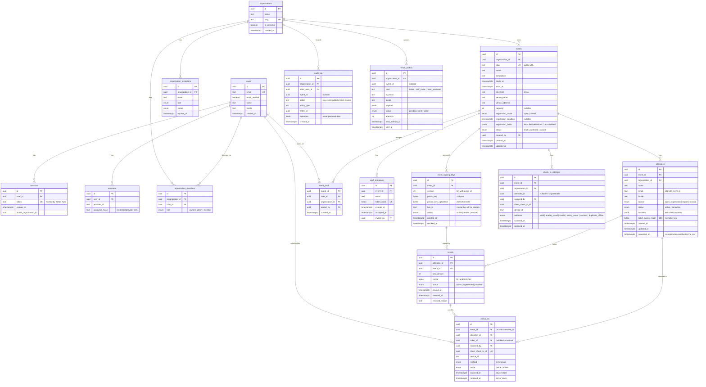

# Data model

> Status: **Proposed** (Phase 0). PostgreSQL 18 + Drizzle ORM. See
> [`ARCHITECTURE.md`](ARCHITECTURE.md) for context.

## Conventions

- Table names: plural `snake_case`. Columns: `snake_case`. Timestamps: `timestamptz`, UTC.
- Primary keys: `uuid` generated with `uuidv7()` (time-ordered, good index locality,
  74 random bits, not enumerable). Never sequential integers in anything exposed.
- Every tenant-scoped table has `organization_id` (denormalized where useful) so queries
  can always be scoped and a future row-level-security policy is trivial to add.
- Emails stored lowercased and trimmed (`email` column, `citext` not required).
- Secrets (access tokens, invitation tokens) are stored only as SHA-256 hashes.
- Enums as Postgres enums managed by Drizzle migrations.

## Changes from the brief's initial list

The brief proposed `users, events, event_staff, attendees/registrations, check_ins,
invitations, audit_log`. Proposed adjustments:

| Change                                                                           | Why                                                                                                                                                                      |
| -------------------------------------------------------------------------------- | ------------------------------------------------------------------------------------------------------------------------------------------------------------------------ |
| Add `organizations` + `organization_members` (+ Better Auth tables)              | Multi-tenant isolation from day one; Better Auth's organization plugin provides them.                                                                                    |
| Merge "attendees/registrations" into `attendees`                                 | One row per person per event regardless of how they arrived (`source` column).                                                                                           |
| Add `tickets`                                                                    | Separates the person from their QR credential: reissue/revoke without touching the attendee; keeps history.                                                              |
| Add `event_signing_keys`                                                         | Per-event Ed25519 keys with versions, rotation and revocation.                                                                                                           |
| Split "invitations" into `staff_invitations` (and Better Auth's org invitations) | Closed-list attendees get their ticket directly (confirmed in Phase 0), so attendee "invitation" is just an `attendees` row with `source = import/manual` plus an email. |
| Add `check_in_attempts`                                                          | Every scan outcome (invalid, wrong event, duplicates from offline sync): audit trail and dashboard reporting without polluting `check_ins`.                              |
| Add `email_outbox`                                                               | Reliable, retryable email delivery in the same transaction as the business change.                                                                                       |

## ER diagram

Better Auth also uses a `verifications` table (email verification, magic link, reset tokens);
it is omitted from the diagram for readability.

## Key constraints and indexes

| Table                | Constraint / index                                                                | Purpose                                                  |
| -------------------- | --------------------------------------------------------------------------------- | -------------------------------------------------------- |
| `events`             | `UNIQUE (slug)`; index `(organization_id, starts_at)`                             | public URLs; organizer listing                           |
| `event_signing_keys` | `UNIQUE (event_id, version)`; partial `UNIQUE (event_id) WHERE status = 'active'` | exactly one active key per event                         |
| `attendees`          | `UNIQUE (event_id, email)`                                                        | no duplicate registrations; closed-list whitelist lookup |
| `tickets`            | partial `UNIQUE (attendee_id) WHERE status = 'active'`                            | one valid QR per attendee                                |
| `check_ins`          | `UNIQUE (event_id, attendee_id)`                                                  | **idempotent check-in** (single entry)                   |
| `check_ins`          | `UNIQUE (client_check_in_id)`                                                     | **idempotent offline sync**                              |
| `check_in_attempts`  | index `(event_id, received_at DESC)`                                              | dashboard feed, duplicate report                         |
| `event_staff`        | PK `(event_id, user_id)`; index `(user_id)`                                       | staff authorization lookup                               |
| `email_outbox`       | index `(status, next_attempt_at)`                                                 | worker polling                                           |

## Deletion and privacy

- **Delete event data** (organizer action): one transaction deletes attendees, tickets,
  check-ins, attempts, staff invitations, outbox rows and signing keys of the event (FK
  `ON DELETE CASCADE` from `events`), then the event itself. An `audit_log` entry
  `event.purge` keeps only IDs and counts.
- `audit_log.metadata` and logs never contain names, emails or tokens.
- Account deletion: Better Auth user deletion; events owned through the organization are
  handled by the organization owner.
